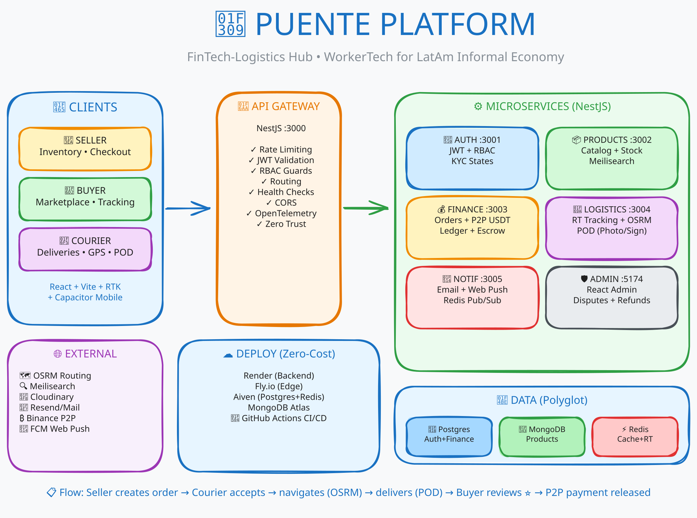
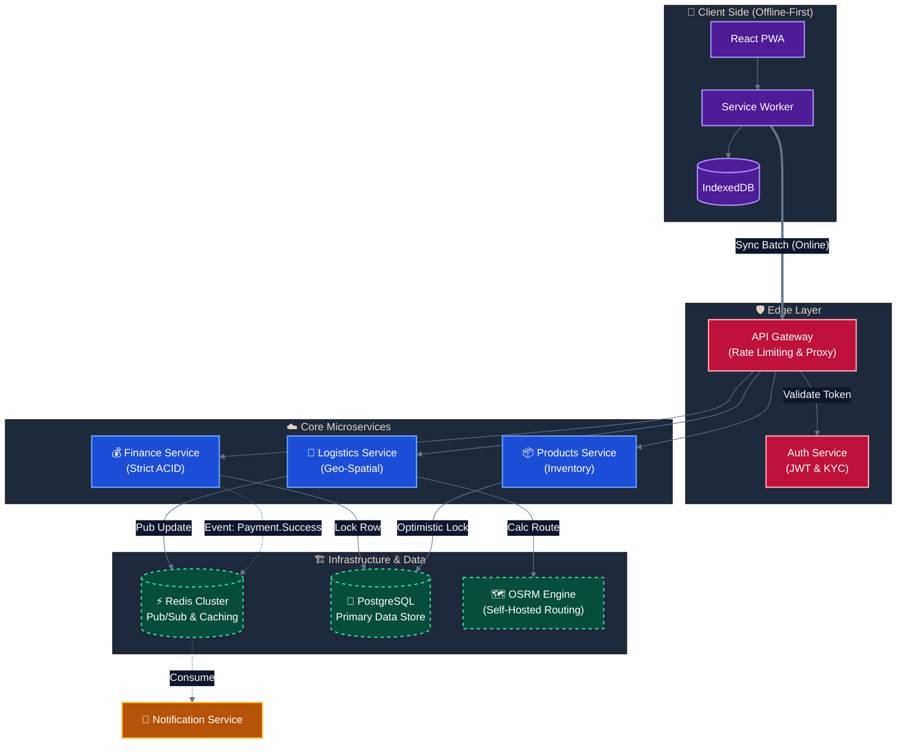
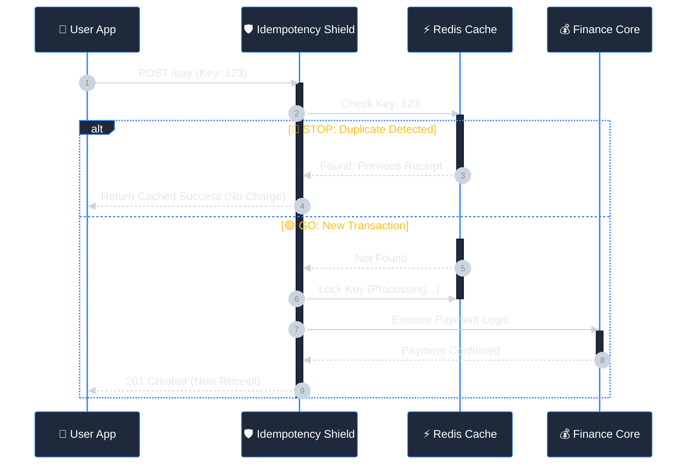
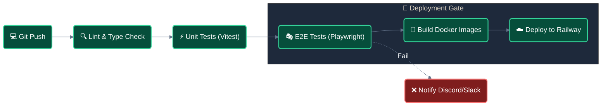

<div align="center">
  <h1>🌉 Puente Platform</h1>
  <h3>Distributed Logistics & Financial Orchestration for Emerging Markets</h3>

  <p>
    
    
    
    
  </p>

  <p align="center">
    <i>
      Engineered to resolve the "Last Mile" & "Unbanked" gap in high-latency infrastructure.<br>
      Leveraging <b>Optimistic UI</b> for seamless UX and <b>Strict ACID Compliance</b> for P2P transactions.
    </i>
  </p>
</div>

<picture>
  <source media="(prefers-color-scheme: dark)" srcset="docs/system-overview-dark.svg">
  <source media="(prefers-color-scheme: light)" srcset="docs/system-overview.svg">
  
</picture>

<div align="center">
  <br/>
  <h3>🚀 ARCHITECTURE SHOWCASE</h3>
  <p>
    <a href="https://puente-architecture.vercel.app/">
      
    </a>
  </p>
  <p>
    Due to cloud infrastructure costs for a multi-service architecture (6 containers + 3 databases),<br/>
    this system is showcased in a <b>local Dockerized environment</b>.
  </p>
  <p>
    👉 <a href="https://puente-architecture.vercel.app/"><b>Watch the full End-to-End System Demo</b></a> including:<br/>
    <i>Offline-first routing (OSRM) • Async notifications • Real-time WebSocket tracking</i>
  </p>
</div>

## ⚡ Quick Summary

**Puente** is a comprehensive ecosystem built to operate reliably in environments with unstable connectivity (High Latency / Partition Tolerance). Unlike traditional platforms that assume perfect network conditions, Puente implements a hybrid consistency model:

1.  **Logistics Domain:** Prioritizes **Availability** (AP) using `Redis Geo` and local `OSRM` instances for real-time routing without external dependencies.
2.  **Finance Domain:** Prioritizes **Consistency** (CP) using distributed locking strategies and `Idempotency Guards` to ensure zero-error financial reconciliation.

## ⛰️ The Engineering Challenge: Building for "High-Entropy" Environments

Developing for Latin America means accepting a harsh reality: **The "Happy Path" rarely exists.**
Network infrastructure is volatile, latency is high, and data plans are expensive. Standard applications that rely on constant connectivity fail here.

**The Problem:**
In a standard delivery app, if a driver confirms a delivery during a signal drop (network partition), the app hangs. If they retry, the server might process the transaction twice (Double Spending).

**The Solution Strategy:**
We designed **Puente** assuming the network is hostile by default.

| Constraint             | Architectural Decision     | Implementation Details                                                                                                                                                                                                     |
| :--------------------- | :------------------------- | :------------------------------------------------------------------------------------------------------------------------------------------------------------------------------------------------------------------------- |
| **Network Partitions** | **Offline-First Strategy** | The PWA acts as the "Source of Truth" for the user. Mutations are optimistically applied to the UI and queued in `IndexedDB`. A background `SyncManager` flushes the queue when connectivity is restored.                  |
| **High Latency**       | **Optimistic UI Updates**  | Users see immediate feedback (e.g., "Order Accepted") without waiting for the server round-trip. State reconciliation happens silently in the background.                                                                  |
| **Unreliable Retries** | **Strict Idempotency**     | The Backend implements an `IdempotencyGuard`. Every critical request carries a unique `Idempotency-Key`. Redis caches the result of the first successful execution to prevent duplicate processing during network jitters. |
| **Data Cost**          | **Edge-Based Routing**     | Instead of querying expensive external Maps APIs for every turn, we self-host **OSRM** (Open Source Routing Machine) with highly optimized local maps, reducing external bandwidth usage by ~90%.                          |

## 🏗️ System Architecture

To solve the conflict between **Financial Integrity** and **Logistical Speed**, I architected the system using a **Microservices pattern** managed within a Monorepo.

I decoupled the domains based on their specific consistency requirements:

- **Finance Service:** Built for strict **ACID compliance**. I used pessimistic locking on the database level to prevent race conditions during P2P transactions.
- **Logistics Service:** Built for **High Throughput**. It leverages an in-memory approach (Redis Geo) and a self-hosted routing engine to handle thousands of location updates per second without blocking the main thread.

### High-Level Interaction Diagram

The following diagram illustrates how the **Offline-First PWA** interacts with the backend through the Gateway, and how services maintain autonomy using an Event-Driven approach.



### Key Architectural Decisions

#### 1. The "Air-Gap" Strategy (Offline Sync)

I recognized that **30% of the user operations happen while disconnected**. Instead of blocking the UI, I implemented a **Command Pattern**:

- **User actions** are serialized as "Jobs" into IndexedDB.
- A **background worker** monitors network status.
- Upon reconnection, the queue is flushed to the API Gateway.
- **Server-side conflicts** are resolved using:
  - "Last-Write-Wins" strategy for logistics.
  - "Manual Resolution" flow for finance.

#### 2. Why Self-Hosted OSRM?

Relying on Google Maps API for real-time tracking of thousands of drivers would make the unit economics unviable ($$$).

**My Solution:** I deployed a dedicated Docker container running **OSRM (Open Source Routing Machine)** with pre-loaded maps of the target region.

- **Latency:** Reduced from ~400ms (External API) to **~15ms** (Internal Docker Network).
- **Cost:** Flat infrastructure cost vs. pay-per-request.

## 🛡️ Section 3: Key Engineering Patterns & Reliability

Building a distributed system requires assuming that **Race Conditions** and **Duplicate Requests** are inevitable. I implemented strict patterns to guarantee data integrity without sacrificing performance.

### 1. Financial Idempotency (Double-Spending Protection)

In unstable networks, clients often retry `POST` requests (e.g., "Pay Order") if they don't receive an ACK immediately. Without idempotency, this causes double charges.

**My Implementation:**
I created a custom `IdempotencyGuard` using Redis. It intercepts mutations based on a unique `X-Idempotency-Key` header generated by the client.



### 2. Concurrency Control: Optimistic Locking

For product inventory (e.g., unexpected "Flash Sales"), strictly locking the database rows (`Pessimistic Locking`) would destroy throughput and cause deadlocks.

**My Strategy:**
I implemented **Optimistic Concurrency Control (OCC)** using versioning logic in Prisma.

1.  Every product has a `version` integer.
2.  Updates strictly enforce the version match condition.
3.  If a race condition occurs, the transaction rolls back, and the client is forced to refresh the state.

```typescript
// Conceptual Implementation in Products Service
async decreaseStock(productId: string, quantity: number, currentVersion: number) {
  const result = await this.prisma.product.updateMany({
    where: {
      id: productId,
      version: currentVersion, // 🔒 The Safety Guard
      stock: { gte: quantity }
    },
    data: {
      stock: { decrement: quantity },
      version: { increment: 1 } // Atomic increment
    }
  });

  if (result.count === 0) throw new ConflictException('Inventory State Changed');
}
```

### 3. Defensive Programming (Zero-Trust Architecture)

I designed the API Gateway to act as a strict shield, ensuring no malformed or abusive traffic reaches the microservices.

- **Rate Limiting (Throttler):** Implemented a **Token Bucket** algorithm (via `NestJS Throttler`) to limit IP bursts, protecting the system from DDoS and brute-force attacks.
- **Runtime Validation:** TypeScript types disappear at runtime. I enforce strict schema validation using **Zod/DTOs** pipes at the Gateway level. If the payload structure is invalid, the request is rejected immediately (400 Bad Request), saving processing power in the core services.

---

## 💻 Section 4: Developer Experience (DX) & CI/CD

A complex microservices architecture usually means a painful setup. I engineered the DX to be as simple as a Monolith.

### ⚡ One-Command Setup

I dockerized the entire platform, including the **OSRM Routing Engine** and **Redis Cluster**. A new developer (or a CI runner) implies zero manual configuration.

```bash
# 1. Start Infrastructure (Postgres, Redis, OSRM)
pnpm docker:up

# 2. Run Database Migrations & Seeds
pnpm db:reset

# 3. Start All Microservices (Hot Reload)
pnpm dev
```

### 🔄 CI/CD Pipelines (GitHub Actions)

I implemented a rigorous pipeline that runs on every Push/PR to `main`, ensuring no broken code reaches production.

| Stage                   | Action                                                                                      | Tooling                 |
| :---------------------- | :------------------------------------------------------------------------------------------ | :---------------------- |
| **1. Static Analysis**  | Checks for circular dependencies and linting errors.                                        | `ESLint`, `Madge`       |
| **2. Unit Testing**     | Runs isolated tests for business logic.                                                     | `Vitest`                |
| **3. End-to-End (E2E)** | Spins up a headless browser to test critical user flows (Login -> Add to Cart -> Checkout). | `Playwright`            |
| **4. Build & Deploy**   | If all green, builds Docker images and pushes to Railway.                                   | `Docker`, `Railway CLI` |



---

## 🗺 Roadmap: From Zero to Distributed Ecosystem

This roadmap tracks the evolution of **Puente Platform** from a conceptual MVP to a resilient, distributed system capable of handling real-world network constraints.

### ✅ Phase 1: Foundation & Infrastructure (COMPLETED)

- **Monorepo Strategy:** Implemented `PNPM Workspaces` to manage shared libraries (DTOs, Types) across Microservices and Frontend.
- **Containerization:** Full Docker support. Created a reproducible `docker-compose` environment that spins up Postgres, Redis, OSRM, and all services with one command.
- **Gateway Implementation:** Deployed a NestJS API Gateway acting as a Reverse Proxy with:
  - [x] **Rate Limiting:** Token Bucket algorithm (Throttler) to prevent abuse.
  - [x] **Request Validation:** Global Zod/DTO Pipes for strict runtime schema validation.
- **CI/CD Pipeline:** Established GitHub Actions workflows for automated Linting, Unit Testing (`Vitest`), and E2E Testing (`Playwright`).

### ✅ Phase 2: Resilience & "Offline-First" (COMPLETED)

- **The "Air-Gap" Solution:** Architected the PWA Synchronization Engine.
  - [x] **Local Persistence:** `IndexedDB` implementation for storing orders/mutations while offline.
  - [x] **Background Sync:** Service Worker logic to flush queues upon reconnection.
- **Financial Integrity:**
  - [x] **Idempotency Layer:** Custom Redis-based Guard to prevent double-spending on retried requests.
  - [x] **Concurrency Control:** Optimistic Locking for inventory management and Pessimistic Locking for wallet transactions.

### ✅ Phase 3: Domain Specialization (COMPLETED)

- **Logistics Engine (No External Dependencies):**
  - [x] **Self-Hosted OSRM:** Deployed Open Source Routing Machine for zero-cost, privacy-first routing.
  - [x] **Geospatial Indexing:** Utilized `Redis GEO` commands for high-performance driver tracking nearby.
- **Observability:**
  - [x] **OpenTelemetry Integration:** Full tracing from Gateway to Database.

---

### 🔮 Phase 4: Future Horizon (NEXT STEPS)

- [ ] **Event Streaming:** Migration from Redis Pub/Sub to **Apache Kafka** to ensure event durability and replayability for analytics.
- [ ] **Orchestration:** Migration from Docker Compose/Railway to **Kubernetes (EKS)** for auto-scaling specific microservices based on load.
- [ ] **Webhooks:** Implementation of a webhook system to notify third-party sellers about order updates.

---

**Engineered by [Mikael Pizzi](https://linkedin.com/in/mikaelpizzi)** | Product-Minded Software Engineer | Full-Cycle & Distributed Systems
